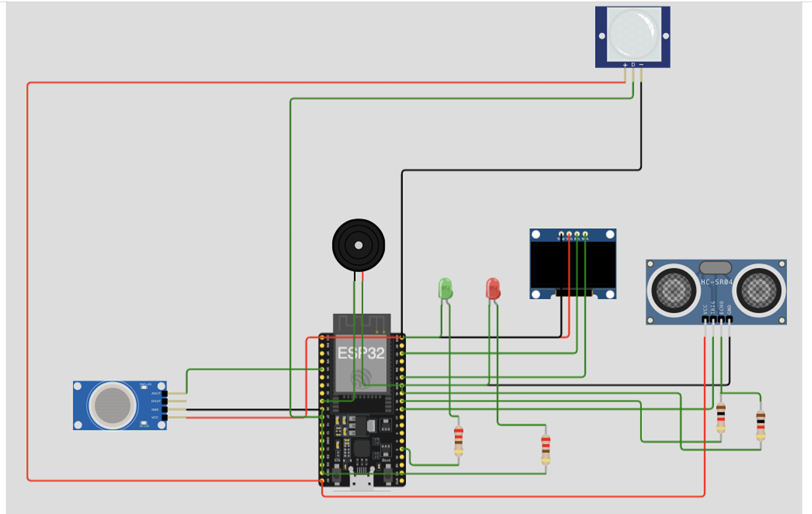
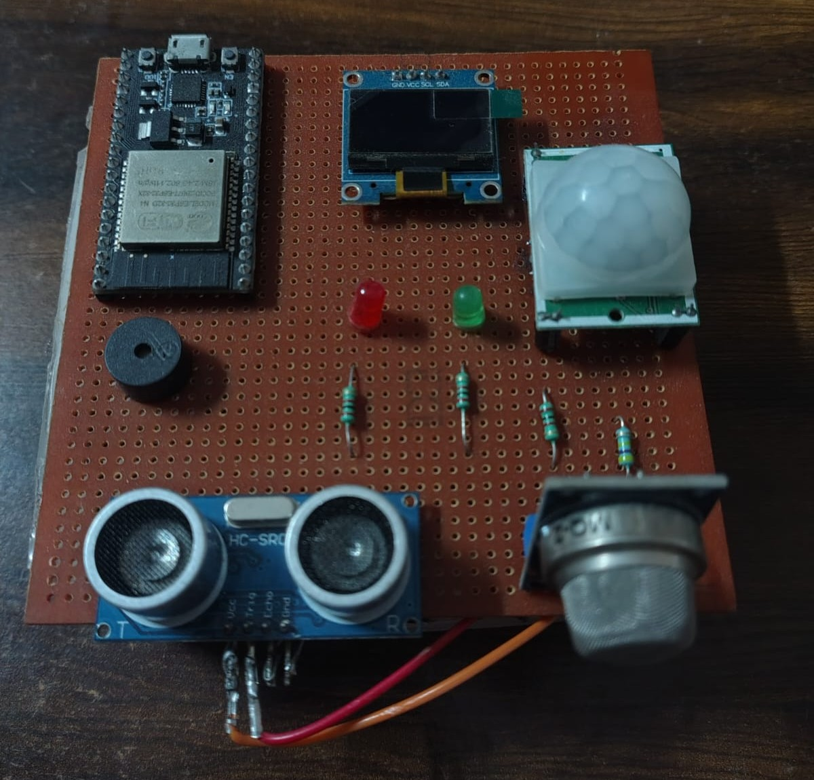
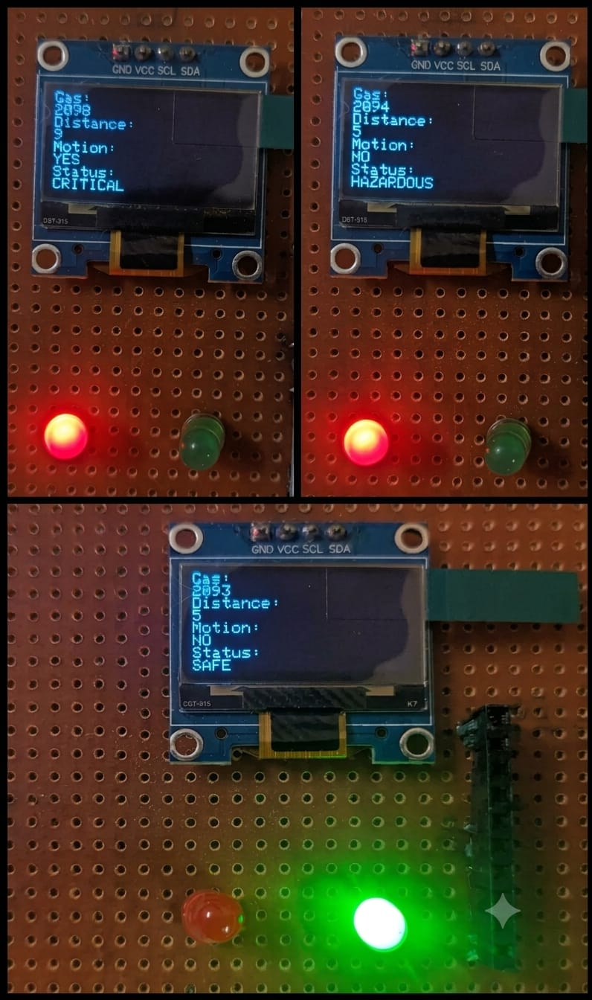
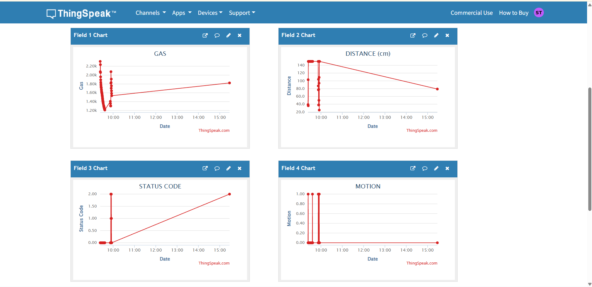
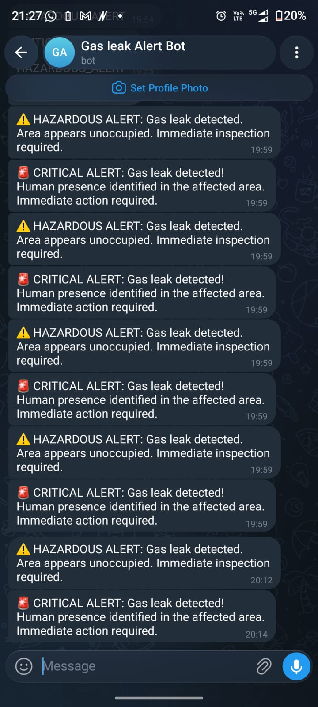

# Smart Industrial Safety and Gas Leak Detection System

An ESP32-based IoT safety monitoring system designed to detect gas leakage, monitor human presence and proximity to the affected area, classify the situation into different safety levels, and provide local and remote alerts.

## Overview

Gas leakage can create serious safety risks in residential, commercial, and industrial environments. This project combines multiple sensors with an ESP32 to continuously monitor environmental conditions and determine the severity of a detected gas leak.

The system uses:

- MQ-series gas sensor for gas-level monitoring
- PIR sensor for human motion detection
- HC-SR04 ultrasonic sensor for proximity measurement
- SSD1306 OLED for local status display
- LEDs and buzzer for local alerts
- ThingSpeak for remote data logging
- Telegram Bot API for remote alerts

The system classifies the monitored environment into three states:

- **SAFE**
- **HAZARDOUS**
- **CRITICAL**

## Key Features

- Real-time gas-level monitoring
- Seven-sample averaging for sensor readings
- Human motion detection using PIR
- Distance measurement using an ultrasonic sensor
- Three-level safety classification
- OLED-based local monitoring
- LED and buzzer warning system
- ThingSpeak cloud data logging
- Telegram-based remote notifications
- Edge-triggered alerts to avoid repeatedly sending the same notification

## System Working

The ESP32 continuously collects readings from the gas sensor, PIR sensor, and ultrasonic sensor.

Seven gas sensor readings are collected and averaged before the safety condition is evaluated. The ultrasonic sensor measures the distance of an object from the sensor assembly.

The system then evaluates the sensor values using predefined thresholds.

### Safety Classification

| Condition | Status | Status Code |
|---|---|---:|
| Gas value < 1750 | SAFE | 0 |
| Gas value >= 1750 without critical human-presence condition | HAZARDOUS | 2 |
| Gas value >= 1750, motion detected, and distance < 100 cm | CRITICAL | 1 |

### SAFE

When the gas reading is below the configured threshold:

- Green LED is turned ON
- Red LED is turned OFF
- Buzzer remains OFF
- System status is displayed as `SAFE`

### HAZARDOUS

When the gas reading reaches or exceeds the threshold but the critical human-presence conditions are not satisfied:

- Green LED is turned OFF
- Red LED is turned ON
- Buzzer is activated
- A Telegram warning is sent when the state changes
- System status is displayed as `HAZARDOUS`

### CRITICAL

When the gas reading reaches or exceeds the threshold and:

- Motion is detected
- Distance is less than 100 cm

the system enters the critical state:

- Green LED is turned OFF
- Red LED is turned ON
- Buzzer is activated
- A Telegram emergency alert is sent when the state changes
- System status is displayed as `CRITICAL`

## Hardware Components

| Component | Purpose |
|---|---|
| ESP32 | Main microcontroller and Wi-Fi communication |
| MQ-series gas sensor | Gas-level detection |
| PIR motion sensor | Human motion detection |
| HC-SR04 ultrasonic sensor | Proximity/distance measurement |
| SSD1306 OLED | Local display of sensor values and status |
| Red LED | Warning indication |
| Green LED | Safe-state indication |
| Buzzer | Audible warning |
| Regulated power supply | Power for the prototype |

## Pin Configuration

| Component | ESP32 Pin |
|---|---:|
| MQ-series Gas Sensor | GPIO 34 |
| PIR Motion Sensor | GPIO 32 |
| HC-SR04 TRIG | GPIO 5 |
| HC-SR04 ECHO | GPIO 18 |
| Buzzer | GPIO 25 |
| Red LED | GPIO 26 |
| Green LED | GPIO 2 |
| SSD1306 OLED | I2C |
| OLED Address | `0x3C` |

## Circuit Diagram

## Project Demonstration

### Real Hardware Prototype

### Safety State Demonstration

### ThingSpeak Dashboard

### Telegram Alert

## Software

The project was developed using:

- Arduino IDE
- Embedded C/C++
- ESP32 Arduino board support
- Wi-Fi communication
- HTTPClient
- Wire
- Adafruit GFX
- Adafruit SSD1306
- ThingSpeak
- Telegram Bot API

## Sensor Processing

The system continuously reads data from the gas sensor, PIR motion sensor, and ultrasonic sensor.

### Gas Sensor Processing

To reduce fluctuations in the gas sensor readings, the system takes **7 consecutive samples** and calculates their average.

`Average Gas Value = (Sample1 + Sample2 + ... + Sample7) / 7`

A delay of approximately **20 ms** is used between consecutive readings.

The gas threshold used for classification is:

`Gas Threshold = 1750`

### Ultrasonic Distance Measurement

The HC-SR04 ultrasonic sensor measures the distance between the sensor and a nearby object.

The distance is calculated using:

`Distance (cm) = (Duration × 0.034) / 2`

The system uses a maximum echo timeout of **30 ms**. If no valid echo is received, a fallback distance value of **150 cm** is used.

The distance threshold for detecting a nearby person is:

`Distance Threshold = 100 cm`

### Motion Detection

The PIR sensor detects whether human motion is present.

`Motion = 1 → Human motion detected`

`Motion = 0 → No motion detected`

The PIR sensor is connected to **GPIO 32** of the ESP32.

---

## OLED Monitoring

A **0.96-inch SSD1306 OLED display** is used to provide local real-time information.

The display shows:

- Gas sensor value
- Distance
- Motion status
- Current safety condition

Example:

`Gas: 2450 | Distance: 150 cm | Motion: NO | Status: HAZARDOUS`

---

## ThingSpeak Cloud Monitoring

The system sends sensor and status data to **ThingSpeak** through Wi-Fi.

Data is uploaded approximately every **15 seconds**.

### ThingSpeak Fields

| Field | Data |
|---|---|
| Field 1 | Gas value |
| Field 2 | Distance |
| Field 3 | Safety status code |
| Field 4 | Motion status |

### Status Codes

| Status Code | Condition |
|---|---|
| 0 | SAFE |
| 1 | CRITICAL |
| 2 | HAZARDOUS |

This allows the sensor data and safety condition to be monitored remotely.

---

## Telegram Alerts

The system uses the **Telegram Bot API** to send alerts when the safety condition changes.

Two alert conditions are generated:

### Hazardous Alert

Triggered when:

`Gas ≥ 1750`

AND

`Critical human-presence conditions are not satisfied`

The system activates the red LED and buzzer and sends a warning notification through Telegram.

### Critical Alert

Triggered when:

`Gas ≥ 1750`

AND

`Motion = 1`

AND

`Distance < 100 cm`

The system activates the red LED and buzzer and sends an emergency Telegram notification.

The alert logic uses a `lastAlert` state variable so that the same alert is not repeatedly sent during every loop iteration.

---

## Testing

The prototype was tested under different combinations of gas concentration, distance, and motion conditions.

| Test Condition | Gas Value | Distance | Motion | Result |
|---|---:|---:|---:|---|
| Safe | 247 | 150 cm | No | SAFE |
| Hazardous | 2450 | 150 cm | No | HAZARDOUS |
| Critical | 2850 | 45 cm | Yes | CRITICAL |

These values represent the reported prototype test conditions.

---

## Reported Prototype Results

During prototype testing, the following results were reported:

- Local decision processing time was measured at **under 145 ms**.
- A **7-sample moving average** was reported to reduce baseline noise by approximately **82%**.
- During a **4-hour stress test**, 960 scheduled ThingSpeak uploads were attempted and 954 were received, corresponding to approximately **99.37%** successful uploads.
- Telegram alert testing reported **100% dispatch success** for tested safety-state transitions.

These results are based on the prototype testing described in the project report and should not be interpreted as industrial-grade safety certification.

---

## Project Structure

`smart-industrial-safety-gas-detection/`

`├── src/`

`│   └── smart_safety_esp32.ino`

`├── docs/`

`│   └── circuit-diagram.png`

`├── images/`

`├── report/`

`├── .gitignore`

`└── README.md`

---

## Security Note

The original system requires credentials for Wi-Fi, ThingSpeak, and Telegram.

For security reasons, **real credentials should never be uploaded to a public GitHub repository**.

Before running the project, configure the following values locally:

`const char* ssid = "";`

`const char* password = "";`

`String apiKey = "";`

`String botToken = "";`

`String chatID = "";`

Replace the blank values with your own credentials only in your local copy.

---

## Future Improvements

Possible improvements include:

- Calibration of the gas sensor for specific gases
- More robust sensor fault detection
- Improved network failure handling
- Secure credential management
- Mobile or web-based monitoring dashboard
- Data logging and historical analysis
- Battery-powered operation
- Enclosure and industrial-grade hardware integration
- Additional gas sensors for multi-gas monitoring

---

## Author

**Sahithi Thotapalle**

Electronics and Communication Engineering  
Sreenidhi Institute of Science and Technology

---

## Project Context

This project was developed as part of an **Embedded Systems / IoT internship project**, focusing on sensor interfacing, ESP32 programming, local safety decision-making, cloud monitoring, and remote alerting.